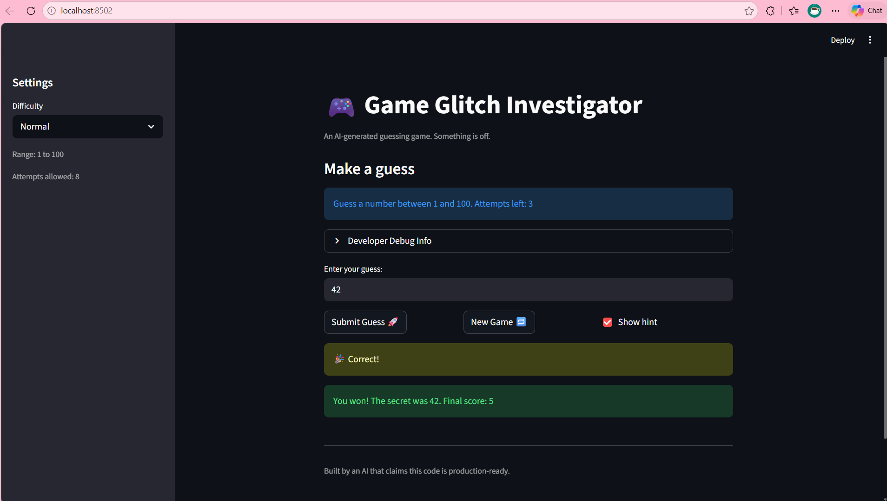

# 🎮 Game Glitch Investigator: The Impossible Guesser

## 🚨 The Situation

You asked an AI to build a simple "Number Guessing Game" using Streamlit.
It wrote the code, ran away, and now the game is unplayable.

- You can't win.
- The hints lie to you.
- The secret number seems to have commitment issues.

## 🛠️ Setup

1. Install dependencies: `pip install -r requirements.txt`
2. Run the broken app: `python -m streamlit run app.py`

## 🕵️‍♂️ Your Mission

1. **Play the game.** Open the "Developer Debug Info" tab in the app to see the secret number. Try to win.
2. **Find the State Bug.** Why does the secret number change every time you click "Submit"? Ask ChatGPT: *"How do I keep a variable from resetting in Streamlit when I click a button?"*
3. **Fix the Logic.** The hints ("Higher/Lower") are wrong. Fix them.
4. **Refactor & Test.** - Move the logic into `logic_utils.py`.
   - Run `pytest` in your terminal.
   - Keep fixing until all tests pass!

## 📝 Document Your Experience

- [x] **Game's purpose:** A number guessing game where the player tries to guess a secret number within a limited number of attempts, with difficulty settings and hint feedback.
- [x] **Bugs found:**
  1. Hints were backwards — "Go HIGHER" appeared when the guess was above the secret and vice versa.
  2. No range validation — numbers outside 1–100 were accepted and cost an attempt.
  3. Invalid input (like letters) still used up an attempt.
  4. New Game button didn't reset game status, so "Game over" message persisted forever.
  5. Off-by-one error in attempt counting — first guess didn't register as an attempt.
- [x] **Fixes applied:**
  1. Swapped the hint messages in `check_guess` so they point the correct direction.
  2. Added range validation in `parse_guess` that rejects out-of-bound numbers with a clear error.
  3. Moved `attempts += 1` to only trigger after a valid guess, so bad input doesn't cost a turn.
  4. Added `st.session_state.status = "playing"` to the New Game reset block.
  5. Changed initial `attempts` from 1 to 0 to fix the off-by-one.
  6. Refactored all game logic from `app.py` into `logic_utils.py`.
  7. Removed the bug where even-numbered attempts converted the secret to a string.

## 📸 Demo

- [  ] []

## 🚀 Stretch Features

- [ ] [If you choose to complete Challenge 4, insert a screenshot of your Enhanced Game UI here]